<h1 align="center">Hi, I'm Shashwat Kulshrestha 👋</h1>

  

  

---

### 🚀 About Me

I'm a Software Developer at **Posterity Consulting**, based in New Delhi, India — working solo across the full stack on internal and client-facing products: architecture, backend, frontend, cloud infra, and security, end to end.

- 🔭 Currently working on **JobRaahi**, an end-to-end hiring/ATS platform for my company (Node.js/Express + React/React Native, deployed on AWS EC2 with a full CI/CD pipeline) — my primary focus at Posterity Consulting.
- 🛡️ Recently led security hardening work on it: PII encryption across hundreds of records, JWT standardization, SQL injection remediation, and MFA rollout.
- 📧 Also built **Postmail** for the company, a bulk email marketing platform (AWS SES/SQS/SNS) replacing a manual, capacity-limited workflow.
- 🏢 And led a multi-tenant SaaS migration for **Reflectify 360**, another company product, including a full backend security audit.
- 🌱 Currently deepening my skills in AWS infrastructure, CI/CD, and applying AI/LLM tooling to production features.
- 👯 Open to collaborating on developer tooling, AI-assisted apps, or cloud infrastructure projects.
- 💬 Ask me about Node.js, React, system architecture, AWS, or shipping AI features in production.
- 📫 Reach me at **shashwat.kul@gmail.com**
- ⚡ Fun fact: I can solve a Rubik's Cube in under a minute.

---

### 💻 Tech Stack

  

---

### 🛠️ Featured Projects

<table width="100%">
<tr>
<td width="50%" valign="top">
<h3>Company Attendance Portal</h3>

A comprehensive attendance and HR portal built with React and Python. Employees track attendance and request leave, while HR manages users, approves requests, and generates reports.

<strong>Stack:</strong> React, Python, PostgreSQL

<a href="https://github.com/shashwatkul/Attendance-Portal">View on GitHub</a> ·
<a href="https://attendancepaypanda.netlify.app">Live Demo</a>

</td>
<td width="50%" valign="top">
<h3>FinTrack — AI-Powered Financial Assistant</h3>

A personal finance app that leverages AI insights to track transactions, manage budgets, and give a clear overview of financial health.

<strong>Stack:</strong> Python, React, TailwindCSS, FastAPI

<a href="https://github.com/shashwatkul/Finance_Assistant">View on GitHub</a>

</td>
</tr>
<tr>
<td width="50%" valign="top">
<h3>Language Recognition & Translation</h3>

Recognizes spoken language, transcribes it, and translates the text into a target language — enabling seamless cross-language communication.

<strong>Stack:</strong> Python, SpeechRecognition, Langdetect, HTML, TailwindCSS

<a href="https://github.com/shashwatkul/speech-translator">View on GitHub</a>

</td>
<td width="50%" valign="top">
<h3>Billing Management System</h3>

Streamlines billing, buyer/product tracking, and invoice generation for retail stores, with PDF bill generation built in.

<strong>Stack:</strong> Java, AWT, MySQL

<a href="https://github.com/shashwatkul/Billing_Management_System">View on GitHub</a>

</td>
</tr>
</table>

> 💡 A couple of demo links from the old version pointed nowhere — removed rather than left broken. Add them back in once live links exist.

---

### 📊 GitHub Stats

  
  

  

  

> ℹ️ **Two notes:**
> 1. These three cards are now generated daily by a GitHub Action and committed to the repo (see `github-stats/`), so they no longer break when the public vercel.app instance is down.
> 2. `count_private=true` only reveals your *private commit count*, not full private-repo detail. Since most of your real output (JobRaahi, Postmail, Reflectify 360) lives in company repos, these cards will still undersell your actual work — that part isn't fixable without a self-hosted instance with a personal access token.

---

### 🤝 Let's Connect

  
  

<!-- Twitter/X badge removed — old link was a placeholder (your-twitter-handle).
     Add it back with your real handle if you want it included:

-->
